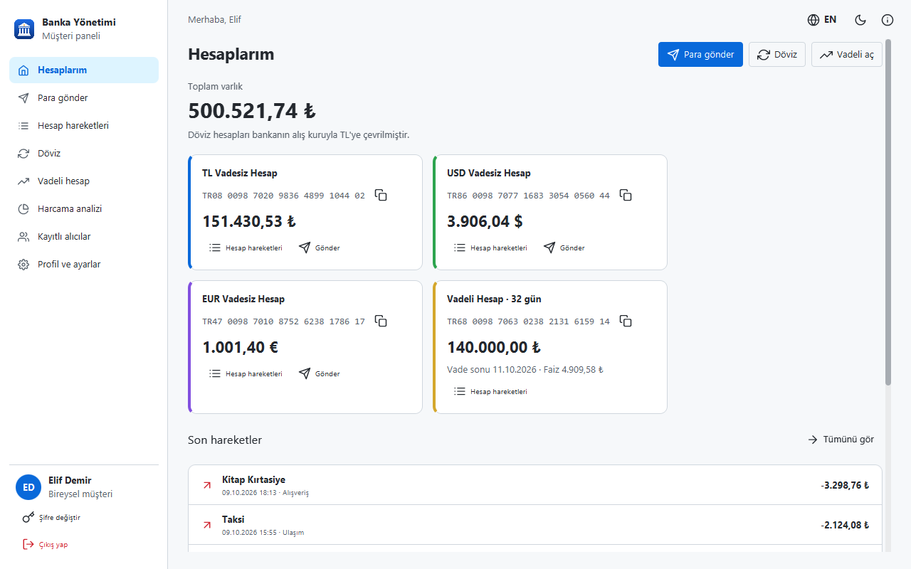
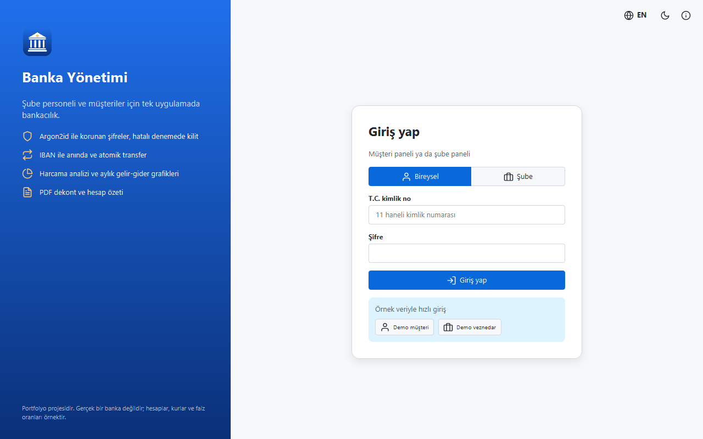
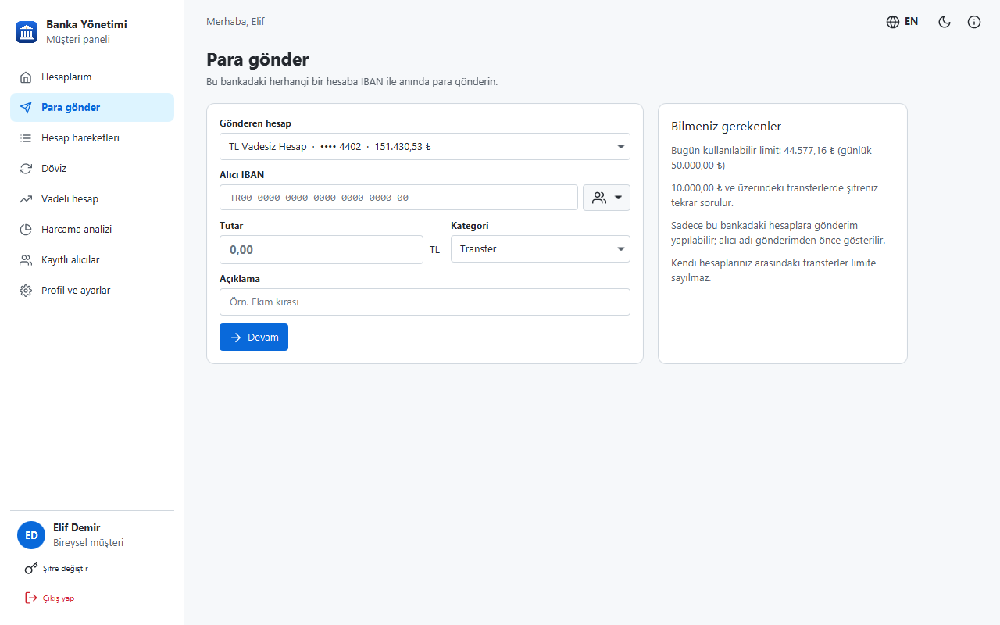
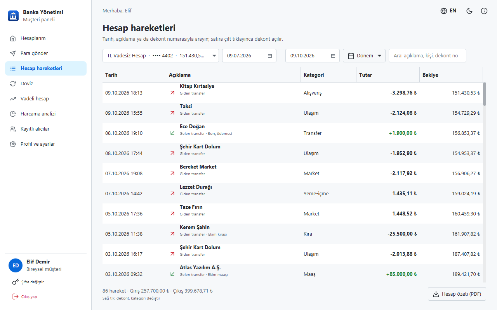
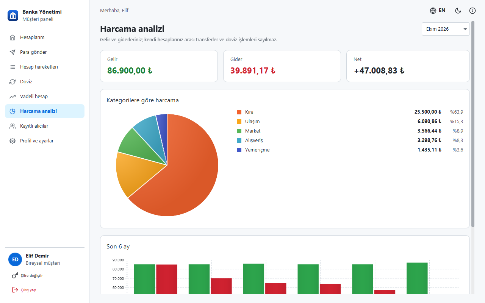
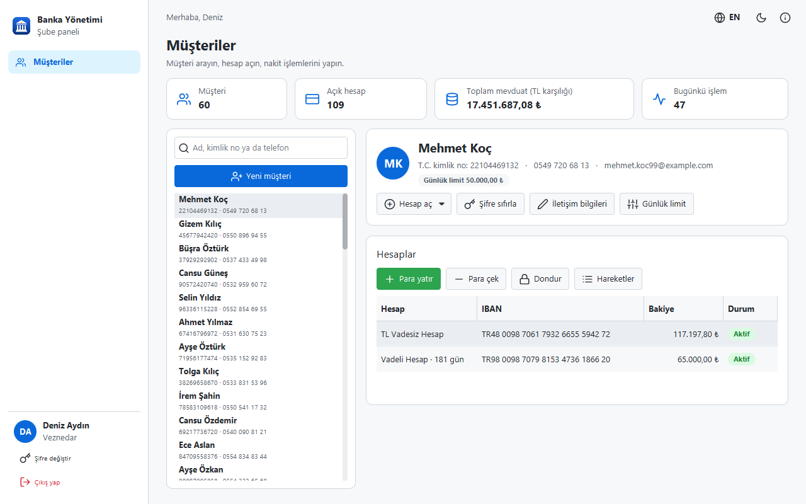
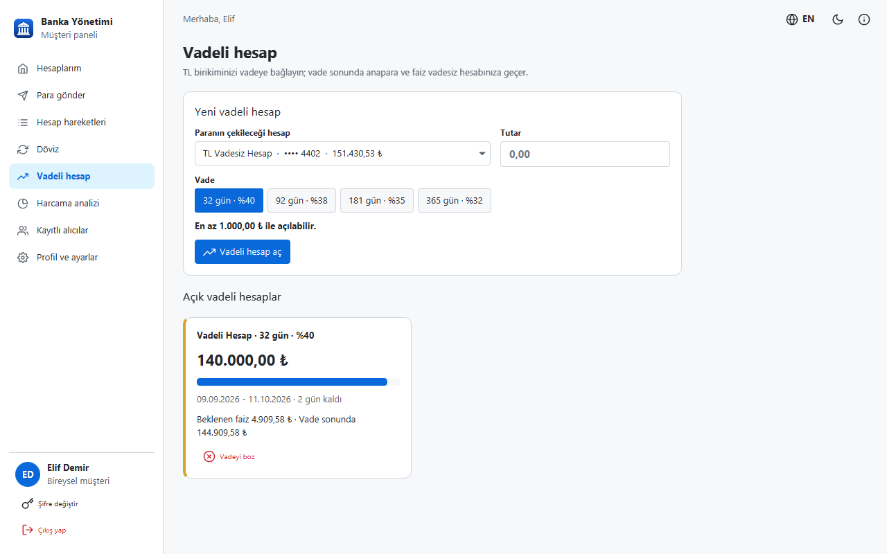
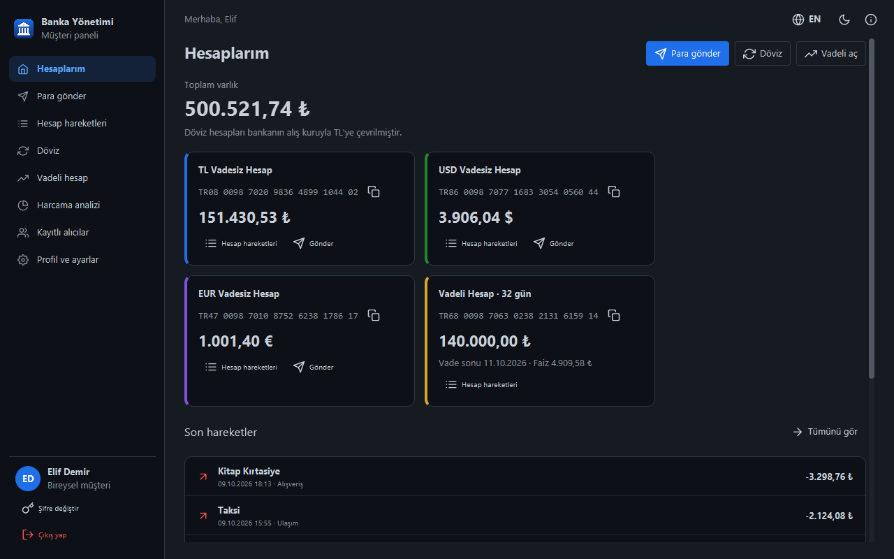

<p align="center">
  
</p>

<h1 align="center">Banka Yönetimi</h1>

<p align="center">
  <a href="README.md">English</a> | <b>Türkçe</b>
</p>

<p align="center">
  Java ve JavaFX ile yazılmış iki taraflı masaüstü bankacılık uygulaması: personelin müşteri ve hesap açıp<br>
  nakit işlemlerini yaptığı <b>şube paneli</b> ve müşterinin kendi parasını yönettiği <b>müşteri paneli</b>.
</p>

<p align="center">
  <a href="https://github.com/MrcDprm/bank-management/releases/latest"><b>⬇️ Windows için indir</b></a>
</p>

<p align="center">
  
</p>

> Bu bir portfolyo projesidir, gerçek bir banka değildir. Uygulama yereldir: şube paneli ve müşteri paneli aynı masaüstü uygulamasının iki tarafıdır ve aynı bilgisayardaki tek bir SQLite veritabanını kullanır; sunucu ya da ağ bağlantısı yoktur. Banka, döviz kurları ve faiz oranları uydurmadır; ürettiği her PDF "örnektir" damgası taşır.

## Özellikler

**Müşteri paneli**
- IBAN'ı tek tıkla kopyalanan hesap kartları, TL karşılığı toplam varlık ve son hareketler
- Banka içinde **IBAN ile para transferi**: IBAN yazılır yazılmaz alıcının adı maskeli gösterilir (`Me**** Ka**`); para yanlış kişiye gitmez
- Takma adlı kayıtlı alıcılar; kendi hesaplar da aynı seçicide çıkar
- Müşterinin kendisinin değiştirebildiği **günlük transfer limiti** ve 10.000 TL üstü transferlerde şifre onayı
- Kendi TL, USD ve EUR hesapları arasında alış/satış kurlu **döviz alım-satımı**
- **Vadeli hesap** (32-365 gün): faiz önizlemesi, ilerleme çubuğu, vadeyi erken bozma ve vade sonunda otomatik ödeme
- Tarih aralığı, arama ve dekont numarasıyla hesap hareketleri; hareketlerin kategorisi değiştirilebilir
- **Harcama analizi:** kategorilere göre harcama (pasta grafik) ve son 6 ayın gelir-gider karşılaştırması (çubuk grafik)
- Her işlem için **PDF dekont**, istenen tarih aralığı için **PDF hesap özeti**

**Şube paneli (personel)**
- Ad, kimlik no ya da telefonla müşteri arama; müşteri, hesap, toplam mevduat ve bugünkü işlem özeti
- Kimlik numarası kontrol basamakları, telefon ve e-posta doğrulamasıyla yeni müşteri; TL hesabı ve geçici şifre oluşturulur
- TL / USD / EUR hesap açma, dekontlu nakit yatırma ve çekme, hesap dondurma ve kapatma
- Şifre sıfırlama (kilidi de açar) ve günlük limit değiştirme
- **Sadece yönetici:** personel yönetimi (yeni veznedar ya da yönetici, rol, pasif yapma, şifre sıfırlama) ve hesap kapatma

**Doğru para işlemleri**
- Tutarlar kuruş/cent cinsinden tam sayı olarak tutulur, asla ondalıklı sayı (double) kullanılmaz
- Her transfer tek bir veritabanı işleminde (transaction) yapılır: para bir hesaptan çıkıp diğerine girmeden kalamaz
- Bakiye kontrolü `UPDATE` ifadesinin içindedir ve veritabanı eksi bakiyeyi de reddeder; eşzamanlı transferler bile hesabı eksiye düşüremez
- Türkiye IBAN'ları ISO 13616 mod-97 kontrolüyle üretilir ve doğrulanır

**Güvenlik**
- Şifreler **Argon2id** (Bouncy Castle) ile özetlenir ve güçlü olmak zorundadır; kurallar yazarken canlı gösterilir
- 5 hatalı girişte hesap 15 dakika kilitlenir; mesaj kimlik bilgisinin mi şifrenin mi yanlış olduğunu söylemez
- Geçici şifre ilk girişte değiştirilmeden hiçbir işlem yapılamaz
- Yetkiler sadece düğme gizleyerek değil, servis katmanında kontrol edilir; müşteri başka müşterinin parasını göremez ve taşıyamaz
- Bütün SQL sorguları parametrelidir; arama metni `LIKE` için kaçışlanır
- 5 dakika işlem yapılmazsa otomatik çıkış
- Beklenmeyen hatalarda kısa bir mesaj çıkar, asla stack trace gösterilmez

**Masaüstü uygulaması**
- Türkçe ve İngilizce, açık ve koyu tema (AtlantaFX)
- İlk açılışta yönetici hesabı oluşturulur; örnek veri (60 müşteri, 6 aylık hareket) tek tıkla yüklenebilir
- Veriler program klasörüne değil kullanıcı klasörüne yazılır (`%APPDATA%\MrcDprm\BankManager`)
- Windows kurulum dosyası, ikon, sürüm ve Hakkında penceresi

## Ekran Görüntüleri

| Giriş | Para gönder |
|:---:|:---:|
|  |  |
| **Hesap hareketleri** | **Harcama analizi** |
|  |  |
| **Şube paneli** | **Vadeli hesap** |
|  |  |

<p align="center">
  
</p>

## Kurulum ve Çalıştırma

1. [Releases](https://github.com/MrcDprm/bank-management/releases/latest) sayfasından `BankManager-1.0.0-Setup.exe` dosyasını indirip çalıştırın. Java kurmanız gerekmez, uygulamanın içinde gelir.
2. İlk açılışta şube yöneticisi hesabını oluşturun. Uygulamayı hemen denemek için **Örnek veri yükle** seçili kalsın.
3. Örnek veri yüklüyse giriş ekranında **Demo müşteri** ve **Demo veznedar** düğmeleri görünür:

| Taraf | Kimlik no / kullanıcı adı | Şifre |
|---|---|---|
| Müşteri paneli | `12345678950` | `Musteri.2026` |
| Şube (veznedar) | `veznedar` | `Sube.Demo2026` |

Verileriniz `%APPDATA%\MrcDprm\BankManager` klasöründe durur. Kaldırmak için Windows "Uygulamalar" ayarlarını kullanın; veri klasörü silinmez, isterseniz elle silebilirsiniz.

## Kullanılan Teknolojiler

- **Java**, **Maven**
- **JavaFX**: arayüz ve grafikler
- **AtlantaFX** (tema), **Ikonli + Feather** (simgeler)
- **SQLite** (sqlite-jdbc): yerel veritabanı
- **Bouncy Castle**: Argon2id şifre özeti
- **Apache PDFBox** + **Noto Sans**: Türkçe karakterli PDF dekont ve hesap özeti
- **JUnit**: testler
- **jpackage** + **Inno Setup**: Windows kurulum dosyası

## Proje Yapısı

```
src/main/java/com/mrcdprm/bank/
├── core/      Para, IBAN, T.C. kimlik no, şifre kuralları ve Argon2id, kurlar, faiz, enum'lar
├── data/      SQLite bağlantısı, şema, transaction ve satır kayıtları
├── service/   Giriş, personel, müşteri, hesap ve transfer, hareketler, alıcılar, örnek veri
├── pdf/       Dekont ve hesap özeti PDF'leri
├── ui/        Giriş, kurulum, şube paneli, müşteri paneli sayfaları, diyaloglar, tema, çeviriler
├── BankApp.java
└── Launcher.java
src/main/resources/   Stiller, ikon, yazı tipleri, Türkçe ve İngilizce metinler
src/test/java/        JUnit testleri
installer/            Derleme betiği, Inno Setup betiği ve ikon
```

## Kaynaktan Derleme

JDK (sürümü `pom.xml`'de) ve Maven gerekir.

```
mvn test          # 43 test
mvn javafx:run    # uygulamayı çalıştır
```

### Kurulum dosyasını derleme

[Inno Setup](https://jrsoftware.org/isinfo.php) gerekir.

```
powershell -ExecutionPolicy Bypass -File installer\build.ps1
ISCC installer\BankManager.iss
```

`build.ps1` testleri çalıştırır, uygulamanın ihtiyaç duyduğu JDK modüllerini `jdeps` ile bulur ve `jpackage` ile içinde küçültülmüş bir Java çalışma ortamı (sadece Türkçe ve İngilizce yerel ayar verisi) olan `dist\BankManager` klasörünü oluşturur. Kurulum dosyası `installer\Output\` içinde oluşur.

**Yeni sürüm çıkarırken:** `pom.xml`, `BankApp.VERSION`, `installer/build.ps1` ve `installer/BankManager.iss` içindeki sürümü güncelleyin, iki komutu çalıştırın ve kurulum dosyasını yeni bir GitHub Release'e yükleyin.

## Öğrendiklerim

- **Para `double` değildir.** İkilik sistemde `0.1 + 0.2` tam olarak `0.3` etmez; bu yüzden her tutarı kuruş cinsinden `long` olarak tuttum, metne sadece ekranda çevirdim. Kullanıcının yazdığını okumak sandığımdan zordu: Türkçede `1.500` bin beş yüz demek, İngilizcede `1,500`; ayrıştırıcı dile ve basamak gruplarına bakarak karar veriyor.
- **Transaction ile atomik transfer.** Bir transfer iki güncelleme ve iki hareket satırı demek. Hepsini tek bir transaction içine koydum; ya hepsi kaydediliyor ya hiçbiri. Bakiye kontrolünü önce okuyup sonra yazmak yerine `UPDATE ... WHERE balance >= ?` ifadesinin içine koydum. Bir test 8 iş parçacığından aynı hesaba 20 transfer gönderip bakiyenin asla eksiye düşmediğini kanıtlıyor.
- **Gerçek dünyadaki numaraları doğrulamak.** IBAN mod-97 kontrolünü (harfler sayıya çevrilir, 97'ye bölümden kalan 1 olmalı) ve T.C. kimlik numarasının kontrol basamaklarını yazdım; hem girdiyi doğrulamak hem de örnek veri üretmek için kullandım.
- **Yetki servis katmanında olmalı.** Her servis metodu oturum açan kişiyi alıyor, rolü ve hesabın sahibini kendisi kontrol ediyor. Düğme gizlemek sadece kolaylık; testler servisleri doğrudan "yanlış" kullanıcıyla çağırıp reddedilmeyi bekliyor.
- **Şifreyi doğru saklamak.** Standart PHC biçiminde rastgele tuzlu Argon2id, sabit süreli karşılaştırma, hatalı denemede kilit, olmayan kullanıcıda da sahte özet hesabı (süre farkı kimin kayıtlı olduğunu ele vermesin) ve saklanan parametrelere sınır (elle değiştirilmiş bir veritabanı uygulamaya gigabaytlarca bellek ayırtamasın).
- **Zamanı test etmek.** Vade ve günlük limit "bugün"e bağlı; bu yüzden servisler bir `Clock` alıyor. Testlerde saati 32 gün ileri alıp faizin tam bir kez ödendiğini kontrol ediyorum.
- **PDF üretmek.** PDFBox metni koordinata çiziyor; ilerleyen bir imleci olan küçük bir katman, tablo başlığı tekrar eden sayfa geçişleri ve son sayfadan sonra eklenen "Sayfa 2 / 5" altlıkları yazdım. PDF'in hazır yazı tiplerinde `ş`, `ğ`, `ı` olmadığı için Noto Sans gömdüm.
- **İki dilli arayüz.** Bütün metinler iki properties dosyasında; bir test kaynak kodu tarayıp kullanılan her anahtarın iki dilde de olduğunu kontrol ediyor. `MessageFormat` kullanmadım, çünkü "TL'ye" gibi Türkçe kelimelerdeki kesme işaretini özel karakter sayıyor.
- **JavaFX ve Windows Forms farkı.** Mutlak konum yerine yerleşim panelleri (`BorderPane`, `VBox`, `GridPane`), özellik penceresi yerine CSS, şifre özeti gibi yavaş işleri arayüzü dondurmadan yapmak için `Task`.

## Gelecek Planları

- Sunucu-istemci sürümü (REST API ve merkezi veritabanı): müşteri kendi cihazından girebilsin
- Zamanlanmış ve düzenli transferler
- Fatura ödeme
- Kartlar ve kart ekstresi
- Başka bankalara transfer (EFT/FAST benzetimi)
- Canlı döviz kurları
- Personel işlemlerinin denetim kaydı

## Lisans

[MIT](LICENSE) © 2026 Miraç Deprem
